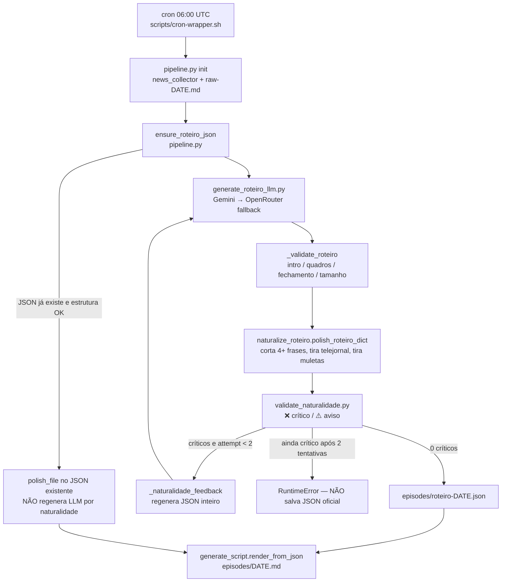

# Vale da Liberdade — Relatório do sistema de roteiro + TTS multi-locutor

**Data:** 2026-08-21  
**Repo:** `/home/osmar/web-jornal-vale-da-liberdade`  
**Objetivo deste documento:** dar a outro sistema (LLM/agente) contexto suficiente para propor melhorias de **naturalidade conversacional** e, sobretudo, de **diferenciação de locutores no áudio**.  
**Sintoma do dono:** no episódio diário (Peter + Ricardo) o segundo narrador soa igual ao primeiro. Não dá para notar troca de voz.

Este arquivo descreve o sistema **como está no código**. Não é spec normativa. Código canônico: os scripts listados em §9.

---

## 1. O que o produto faz

Dois produtos de áudio:

| Produto | Locutores | Modelo TTS | Script |
|---|---|---|---|
| **Diário** (Blumenau e região) | Peter + Ricardo, diálogo | `gemini-3.1-flash-tts-preview` multi-speaker | `scripts/pipeline.py full` → `generate_gemini_tts_multi.py` modo **PACKED** |
| **Brasil e Mundo** (ANCAPSU) | Peter solo | `gemini-2.5-flash-preview-tts` single | `scripts/bm_pipeline.py` → mesmo `generate_gemini_tts_multi.py` com `--single-speaker Peter --mode halves` |

O problema de “mesma voz” é do **Diário**. BM é um locutor só (Charon). Não misturar os dois pipelines na análise.

Personas (texto editorial, independentes do timbre TTS):

- **Peter Albuquerque** — anarcocapitalista, irônico, provocador. TTS: **Charon** (masculina, grave).
- **Ricardo Souto** — contrapeso pragmático/dados, energia de rádio. Persona **masculina** no roteiro; voz TTS em avaliação **feminina** (ver §6) só para diagnosticar colapso de locutor.

---

## 2. Diagrama — geração do roteiro (texto)

Foco: naturalidade **textual** (SKILL §7.1). Isso NÃO diferencia timbre.



### Política C (importante para quem for mexer)

Arquivo: `scripts/pipeline.py` → `ensure_roteiro_json`.

- Falha de **estrutura** (`_validate_roteiro`) → regenera LLM.
- Só falha de **naturalidade** no JSON já salvo → **não** regenera. Só aplica `polish_file`.
- `cmd_validate` (etapa 4 do `full`) ainda **barra áudio** se houver `❌` de naturalidade no MD.
- `cmd_full` **sempre** chama `ensure`. MD “rico” (≥500 palavras) **não** autoriza pular o JSON.

Ou seja: o loop de naturalidade “de verdade” (LLM reescreve) só roda na **geração** (`generate_roteiro_json`, `max_attempts=2`). No dia seguinte, se o JSON já existe, o texto ruim pode passar pelo polish heurístico e só ser barrado na validate — ou passar se o polish mascarar os ❌.

---

## 3. Diagrama — TTS multi-locutor (áudio)

Aqui está o gargalo do sintoma “mesma voz”.

```mermaid
flowchart TD
  md["episodes/DATE.md"] --> pre["tts_preprocessor.preprocess_for_tts<br/>siglas, moeda pt-BR, pausas, Peter→Piter"]
  pre --> ttsTxt["episodes/DATE-tts.txt"]
  ttsTxt --> packed["modo PACKED default<br/>split_into_chunks por PAUSA + CHUNK_TARGET_WORDS"]
  packed --> call["1 chamada Gemini por chunk<br/>multi_speaker_voice_config<br/>Peter=Charon, Ricardo=Kore<br/>temperature GLOBAL 0.9"]
  call -->|"PCM usável"| concat["concatena PCM 24 kHz + silêncios"]
  call -->|"falha / RMS baixo"| edge["fallback Edge POR FALA<br/>hoje: os dois eram AntonioNeural"]
  concat --> fx["ffmpeg: highpass → compressor → EQ 3.5 kHz → loudnorm -16 LUFS<br/>MESMA cadeia para os dois locutores"]
  fx --> mp3["audio/DATE.mp3"]
```

### Como o Gemini recebe os dois locutores

Em `scripts/generate_gemini_tts_multi.py`:

1. `SPEAKERS = {"Peter": "Charon", "Ricardo": "Kore"}` (Kore = voz feminina de avaliação).
2. Cada chunk vai com `SpeechConfig.multi_speaker_voice_config` listando os dois `SpeakerVoiceConfig`.
3. O **texto** do chunk ainda tem rótulos `Peter:` / `Ricardo:`.
4. `system_instruction` (`build_system_instruction`) descreve personas + sotaque pt-BR neutro. Enviada em **toda** chamada para tentar manter timbre entre chunks.
5. `temperature = 0.90` **global**. Não há temperatura por locutor (foi removida a pedido do dono: “deixe 0,9 global”).

### Por que o próprio código já desconfia de colapso

`sources/gemini_limits.json` e o comentário do modo PACKED:

> 1 chamada só com o episódio inteiro **COLAPSA em voz única** (Gemini perde o contexto de 2 locutores em texto longo). Por isso usa-se chunking.

Mitigação atual: chunks ~200–300 palavras, 1 chamada multi-speaker por chunk. O dono **ainda** ouve uma voz só — então o colapso provavelmente **sobrevive ao chunking**, ou o segundo `voice_name` não está sendo honrado pela API.

---

## 4. Camada de naturalidade (texto) — o que existe hoje

Três peças, todas **sobre o roteiro escrito**, zero análise de áudio.

### 4.1 Prompt de geração — `scripts/generate_script.py` → `build_script_prompt`

Regras injetadas no LLM:

- Diálogo de radialistas, não telejornal.
- Ricardo: energia, interjeições, dados, **proibido** tom de nota oficial.
- Peter: ironia libertária, frases curtas.
- 2–3 frases por fala; nunca 4+.
- Chamar o outro pelo nome **com parcimônia**, **sem vírgula** (`estado Peter`, não `estado, Peter`) — vírgula vira pausa artificial no TTS.
- Proibido empilhar muletas: “Olha, vai daí…”, “Pois é, e tem mais: peter,”.
- O validador reprova aberturas tipo “Na segurança…”, “E em Blumenau…”.

Personas também em:

- `presenters/peter.md`
- `presenters/ricardo.md`
- `prompt.md` (histórico; o prompt vivo é o de `generate_script.py`)
- `SKILL.md` (voz/roteiro diário — não espelha 1:1 a skill Hermes `web-jornal-production`)

### 4.2 Polish heurístico — `scripts/naturalize_roteiro.py`

Pós-processa o JSON **sem LLM**:

- Strip de aberturas de telejornal.
- Strip de muletas no início da fala (`Vai daí`, `agora segura essa`, `pois é, e tem mais`).
- Corta falas com 4+ frases para no máx. 3.
- Injeta chamada de nome com parcimônia.
- **Não** injeta mais transições mecânicas (soava robótico).

Risco: o polish pode deixar o texto “válido” para o regex e **menos** falado — frases amputadas, reações genéricas.

### 4.3 Validador — `scripts/validate_naturalidade.py`

Heurísticas (não há modelo de naturalidade):

| Check | ❌ crítico | ⚠️ aviso |
|---|---|---|
| < 6 falas | sim | |
| Um locutor com 0 falas, ou < 20% das falas | sim | |
| ≥2 aberturas de telejornal | sim | 1 abertura = aviso |
| Fala com 4+ frases | sim | 3 frases longas / 2 frases densas |
| Muletas de transição em excesso | sim se ≥8 ou ≥1/3 das falas | ≥5 ou ≥1/4 |
| Conectores banidos (`e para detalhar`, `isso mesmo`, `exatamente,`) | sim | |
| Reação à fala anterior (overlap de palavras / opener / nome) | | se ≥45% das falas não reagem |
| Poucos chamados pelo nome | | < max(2, n/10) |
| Nome com vírgula | | ≥3 |
| Peter em loop anti-Estado | | ≥75% das falas dele |

**Buraco:** nada mede se Ricardo **soa** diferente de Peter. Nada mede overlap de timbre, F0, ou se o Gemini ignorou `Ricardo:`.

---

## 5. Hipóteses para “sempre a mesma voz” (priorizar nesta ordem)

Para o sistema que for propor melhorias. Testar, não chutar.

### H1 — Colapso multi-speaker do Gemini (mais provável)

A API recebe dois `SpeakerVoiceConfig`, mas sintetiza o chunk inteiro com **uma** voz (quase sempre a primeira = Charon). Sintomas:

- Troca `Peter:`/`Ricardo:` no texto, mas o áudio não muda de timbre.
- Piora em chunks longos ou no meio/fim do episódio.
- Já documentado para episódio inteiro; pode ocorrer **por chunk**.

**Teste decisivo (em curso):** voz do Ricardo **feminina** (`Kore`). Se continuar soando homem grave = colapso confirmado. Se passar a ouvir mulher nas falas `Ricardo:` = o mapeamento funciona e o problema era só similaridade Charon/Alnilam.

### H2 — Rótulos e persona masculina enviesam o timbre

Mesmo com `voice_name=Kore`, o texto diz “Ricardo” (homem, 46 anos, economista) e o system prompt descreve atuação masculina de rádio. O modelo pode **ignorar** o voice id e clonar Charon.

### H3 — Fallback Edge usa a mesma voz

`EDGE_SPEAKER_STYLE` (antes desta mudança) era `pt-BR-AntonioNeural` para **os dois**, só `rate` diferente (`+12%` vs `+6%`). Dono relatou que **quase nunca** cai no Edge (“só tenho percebido no áudio do Gemini”). Ainda assim, se um chunk cair no Edge, some a diferença.

Há `scripts/ricardo_voice_fx.py` (formant/pitch) pensado exatamente para “mesma voz Edge”. **Não está na cadeia Gemini.** Só faria sentido no fallback.

### H4 — Pós-ffmpeg homogeneíza

Uma cadeia só (`highpass 80 Hz`, compressor, boost ~3.5 kHz, loudnorm −16 LUFS) nos dois locutores. Não explica “idêntico”, mas reduz contraste.

### H5 — Temperatura global não “não chega no Ricardo”

Dono (2026-08-18): Ricardo mais monótono, temperatura maior “não atinge ele”. Hoje `TTS_TEMPERATURE = 0.90` único. Em multi-speaker a temperatura é da **chamada**, não por speaker. Não dá para “esquentar” só o Ricardo sem split por fala.

### H6 — Modo errado / script errado no Diário

- PACKED = multi-speaker por chunk (Diário).
- HALVES = junta todos os turnos, **uma** voz, 2 chamadas (BM Peter).
- TURNS = 1 chamada por fala (caro em RPD).
- `generate_gemini_tts.py` = single-speaker legado.

Se o Diário um dia rodar HALVES ou o solo script, vira uma voz só por definição. Conferir o log do cron: `Modo PACKED`.

### H7 — Inconsistência de voice id no repo (antes desta avaliação)

No momento do relatório havia drift:

| Lugar | Ricardo |
|---|---|
| `generate_gemini_tts_multi.py` `SPEAKERS` | Aoede (já feminina, working tree) |
| `generate_gemini_tts.py` `VOZES` | Alnilam |
| `generate_script.py` `PERSONAS` | Alnilam |
| `presenters/ricardo.md` | Alnilam |
| `build_system_instruction` texto | ainda dizia Alnilam |
| Edge | AntonioNeural nos dois |

O Diário usa o mapa `SPEAKERS` do multi. Drift nos outros arquivos não causa o colapso, mas confunde diagnóstico.

---

## 6. Mudança de avaliação aplicada junto com este relatório

Pedido do dono: **voz feminina no Ricardo** para ouvir a troca.

| Campo | Antes (produção recente) | Avaliação |
|---|---|---|
| Gemini Ricardo | Alnilam (m) / Aoede (f, parcial) | **Kore** (f, firme) |
| Gemini Peter | Charon (m) | Charon (inalterado) |
| Edge Ricardo | AntonioNeural | **pt-BR-FranciscaNeural** |
| Edge Peter | AntonioNeural | AntonioNeural |

Persona textual continua “Ricardo Souto”, homem. Só o timbre TTS muda. Reverter para voz masculina depois do teste (Alnilam / Algenib / etc.).

**Não regeneramos** o MP3 de 2026-08-21 neste passo (cota Gemini). O teste vale no **próximo** `pipeline.py full` / áudio.

---

## 7. Onde mexer se a meta for naturalidade de **diálogo**

Ordem sugerida (texto):

1. `scripts/generate_script.py` — `build_script_prompt` + `PERSONAS`.
2. `scripts/generate_roteiro_llm.py` — tentativas, feedback, backends.
3. `scripts/naturalize_roteiro.py` — risco de “validar” texto morto.
4. `scripts/validate_naturalidade.py` — regex; fácil de overfit.
5. `prompt.md` / `SKILL.md` / `presenters/*.md` — canônicos de persona; o LLM do roteiro lê o prompt de `generate_script.py`, não o SKILL.md inteiro, a menos que o Hermes injete.

O validador **não ouve**. Melhorar naturalidade de áudio não passa por mais regex.

---

## 8. Onde mexer se a meta for **duas vozes distintas**

Ordem sugerida (áudio):

1. Confirmar H1 com Kore (esta avaliação).
2. Se colapso: **não** insistir em multi-speaker na mesma chamada. Alternativas:
   - Modo TURNS: 1 chamada single-speaker por fala (`generate_single_speaker_pcm`), concatenar. Custo: ~N falas × RPD (hoje ~20–40 falas; 3.1 TTS tem RPM/RPD baixos — ver `gemini_client.py` e `sources/gemini_limits.json`).
   - Híbrido: 1 chamada por **bloco de um locutor** (run-length: junta falas consecutivas do mesmo speaker). Menos chamadas que TURNS, ainda single-voice por bloco — o Gemini não precisa “lembrar” dois timbres.
   - Dois modelos/vozes e mix ffmpeg.
3. Edge: vozes **diferentes** (feito nesta avaliação) + opcional `ricardo_voice_fx.py`.
4. FX ffmpeg **por locutor** se voltar a TURNS/híbrido (hoje o FX é no mix final).
5. Não gastar cota do Diário (`gemini-3.1-flash-tts-preview`) no BM; BM já deve estar em `gemini-2.5-flash-preview-tts`.

Restrições de cota (não ignorar numa proposta):

- TTS 3.1 na tabela local ≈ **3 RPM → 20 s** entre chamadas; failover do anel **só** em cota diária, não em 429 de RPM.
- Chaves: `GEMINI_API_KEY` … `_7` no `.env` **do projeto**.
- `CHUNK_TARGET_WORDS` (memória: baixado de 300 para 200; o default no arquivo pode ter voltado a 300 — **ler o código**, não este parágrafo).

---

## 9. Pacote de scripts para enviar ao outro sistema

Mínimo (Diário + naturalidade + TTS):

```
scripts/pipeline.py
scripts/generate_script.py
scripts/generate_roteiro_llm.py
scripts/naturalize_roteiro.py
scripts/validate_naturalidade.py
scripts/tts_preprocessor.py
scripts/generate_gemini_tts_multi.py
scripts/generate_gemini_tts.py
scripts/gemini_client.py
scripts/ricardo_voice_fx.py
presenters/peter.md
presenters/ricardo.md
sources/gemini_limits.json
prompt.md
SKILL.md
```

Úteis, não misturar com o Diário:

```
scripts/bm_pipeline.py
scripts/bm_condensador.py
```

Amostra de episódio real (texto, não áudio):

```
episodes/2026-08-21.md
episodes/2026-08-21-tts.txt
episodes/roteiro-2026-08-21.json
```

Cron:

```
scripts/cron-wrapper.sh
```

Python do cron: `/home/osmar/.hermes/hermes-agent/venv/bin/python3` (não o python do sistema). `num2words` **não** está nesse ambiente; o preprocessor de moeda foi ajustado para não depender dele (ordem “50 mil reais”).

---

## 10. Snapshot de config TTS (após a mudança de avaliação)

| Chave | Valor |
|---|---|
| Modelo Diário | `gemini-3.1-flash-tts-preview` |
| Modo Diário | PACKED (chunks) |
| `TTS_TEMPERATURE` | 0.90 global |
| `CHUNK_TARGET_WORDS` | ver constante no multi (não confiar em comentários velhos) |
| Peter Gemini | Charon |
| Ricardo Gemini | **Kore** (avaliação feminina) |
| Peter Edge | pt-BR-AntonioNeural, rate +12% |
| Ricardo Edge | pt-BR-FranciscaNeural |
| Loudnorm | −16 LUFS, 2-pass |
| ElevenLabs | nunca em produção; não restaurar |
| MOSS-TTS-Nano | desligado até fine-tune pt-BR |

---

## 11. Pedido explícito ao sistema analista

Entregar propostas **separadas**:

**A. Naturalidade do roteiro (texto)**  
Como o diálogo deixa de parecer dois blocos de editorial colados, sem overfit no validador regex, sem muletas, com réplica real.

**B. Multi-locutor (áudio)**  
Como garantir dois timbres distintos no Gemini 3.1 flash TTS, com orçamento de RPD/RPM. Incluir plano B se `multi_speaker_voice_config` for inerentemente instável nesse modelo.

Não misturar BM (Peter solo, modelo 2.5) com o Diário.

Não propor ElevenLabs. Não reintroduzir karaoke palavra-a-palavra.

Critério de aceite do dono para B: **ouvir claramente dois locutores** no Diário, sem precisar ler o roteiro para saber quem falou.
